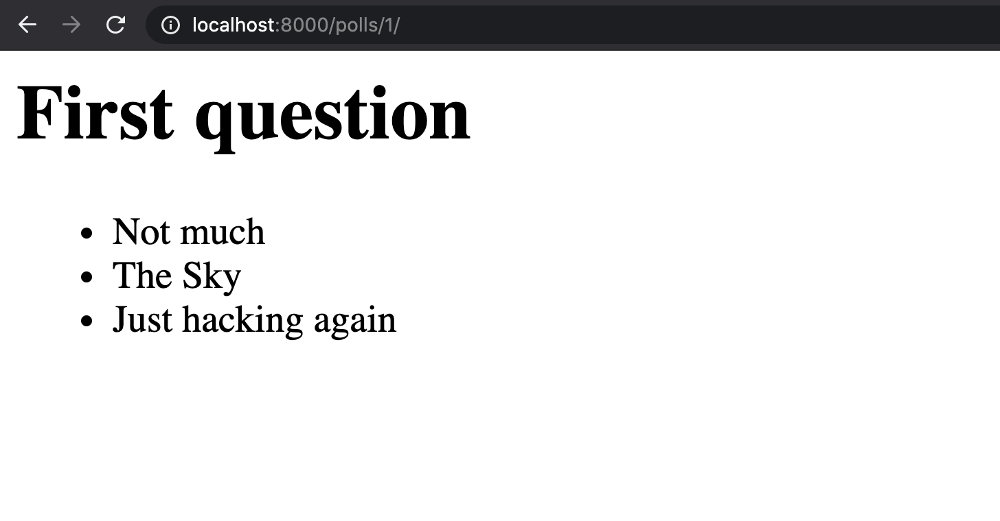

### My Django learning notes

## Day 1: Sat, 5-6PM, 29th June, 2020

- Editor Used [VS Code](https://code.visualstudio.com/)
- Terminal Type [OhMyZsh](https://ohmyz.sh)
  - Theme: [Agnoster](https://github.com/agnoster/agnoster-zsh-theme)
- What is peer learning? [Click here](https://en.wikipedia.org/wiki/Peer_learning)
- [Python Downloads](https://www.python.org/downloads/)
- Django Install

  ```
  python -m pip install Django
  ```

- [Django Getting Start](https://www.djangoproject.com/start/)

### Tips

- Use official documentation
- Try to type every command mentioned in tutorial
- Question why the tutorial is saying this or that way
- Don't afraid from errors. Try to make love to them because this will help you improve.
- There are many types of Errors:
  - Typo Error (Human Error)
  - System Error
  - Package level Error
  - ...

- Full Stack Definition
  - Back-end and Front-end ( Old )
  - Back-end, Front-end and DevOps (you should be able to deploy your code to server) ( Now )

### Building first Django

  Reference link [here](https://docs.djangoproject.com/en/3.0/intro/tutorial01/).

  - Verify Django

    ```
    $ python -m django --version
    ```

  - Create Project

    ```
    $ django-admin startproject mysite
    ```

  - Run Server

    ```
    $ python manage.py runserver
    ```

  - Open [http://127.0.0.1:8000/](http://127.0.0.1:8000/) in browser

### Creating the Polls app

  [Click here](https://docs.djangoproject.com/en/3.0/intro/tutorial01/#creating-the-polls-app)

### Database Setup

  [Click here](https://docs.djangoproject.com/en/3.0/intro/tutorial02/#database-setup)

  NOTE: Skip `Introducing the Django Admin` as it might be advanced for complete beginner

### Creation Question View, Route

  Use following lines in `polls/views.py`

  ```
  from django.shortcuts import get_object_or_404, render

  from .models import Question

  def index(request):
    return HttpResponse("Namaste, World. You are at the polls index")

  def detail(request, question_id):
    question = get_object_or_404(Question, pk=question_id)
    return render(request, 'polls/detail.html', {'question': question})
  ```

  And, set path in `polls/urls.py`:

  ```
  from django.urls import path

  from . import views

  urlpatterns = [
    path('', views.index, name='index'),
    path('<int:question_id>/', views.detail, name='detail'),
  ]
  ```

  And, template file `polls/templates/polls/detail.html`:

  ```
  <h1>{{ question.question_text }}</h1>
  <ul>
    
        <li>{{ choice.choice_text }}</li>
    
  </ul>
  ```

## Day 1 Output



**NOTE:** If you type `/polls/2` then you will get error since you haven't created question with id 2.
